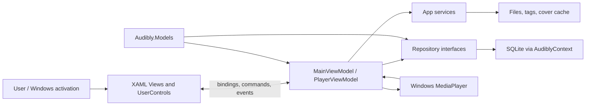
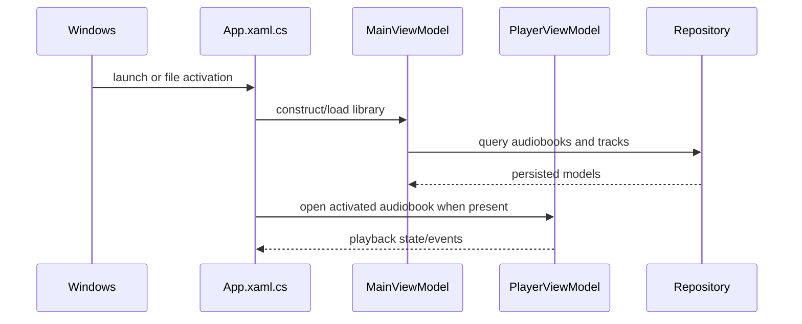
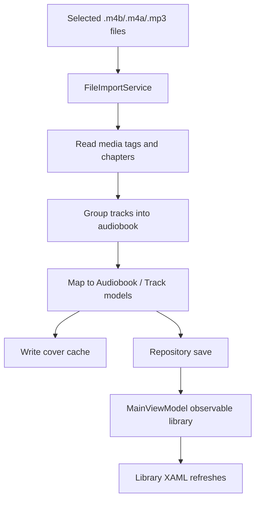
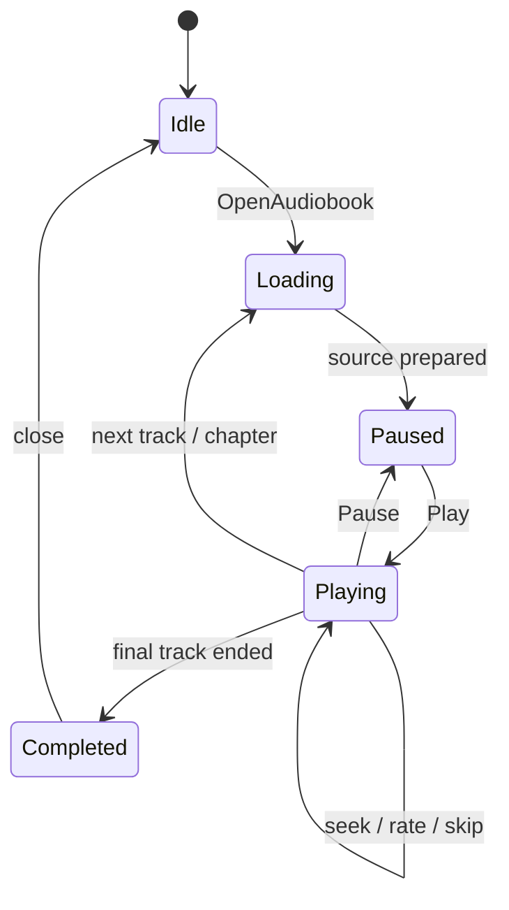

# Audibly architecture and MVVM tutorial

This fork is a native WinUI 3 audiobook player. Its architecture is pragmatic
MVVM: XAML views bind to long-lived view-models, services perform I/O, models
carry state, and repositories persist the library. A few app-wide singletons in
`App.xaml.cs` are the composition root and also the main coupling seam.

## The map

The important folders are:

- `Audibly.App/Views` and `UserControls`: presentation and interaction.
- `Audibly.App/ViewModels`: observable state and user operations.
- `Audibly.App/Services`: imports, dialogs, app data, local logging, and
  messaging.
- `Audibly.Models`: library and playback entities shared across layers.
- `Audibly.Repository`: repository interfaces and SQLite implementations.
- `eng/windows-dev.ps1`: the repeatable verify/build/signed-MSIX/install loop.

## Startup: follow the composition root

Start with `Audibly.App/App.xaml.cs`. It constructs the shared
`MainViewModel` from `FileImportService`, `AppDataService`, `LoggingService`,
and the repository. It also owns the shared `PlayerViewModel`. Activation then
creates the main window and routes file/protocol activation into those objects.

When debugging a startup failure, determine whether it occurs before the
window exists (composition/packaging), while the library loads
(repository/migration), or after a track is opened (media pipeline).

## Import flow

`FileImportService` is the dense boundary between arbitrary user files and the
library model. It reads tags and chapters, groups multi-file books, derives a
stable hash, writes cover art through `AppDataService`, and returns models for
persistence. Keep format-specific detection here; keep presentation decisions
in the view-model.

Audio extension support has four entry points: picker filters, watched-folder
filtering, package file associations, and user-facing copy. `.m4a` is wired
through all four. Do not build a second library path for a container MediaPlayer
already supports.

## Playback flow

`PlayerViewModel` owns the Windows media player, current audiobook, track
selection, position, rate, skip controls, and save-on-exit behavior. Views bind
to it; they should not independently open files or persist progress.

If playback UI and audio disagree, inspect event subscription and property
notification in `PlayerViewModel` before changing XAML.

## Persistence and packaging

The repository layer isolates SQLite operations from the view-model. App-local
files such as cover images go through `AppDataService`. The installed build is
identity-bearing MSIX, because Windows App SDK storage APIs and activation
behave differently for an unpackaged executable.

The fork deliberately contains no telemetry, crash uploader, update client, or
backend. Errors stay in local logs. Updates mean building a higher-version
signed MSIX with `eng/windows-dev.ps1 Update`.

## A productive change workflow

1. Locate the user action in XAML and its bound property/handler.
2. Follow it into `MainViewModel` or `PlayerViewModel`.
3. Put filesystem/media work in a service and database work behind a
   repository.
4. Add focused tests before changing behavior.
5. Run `eng/windows-dev.ps1 Verify`, then `Package`, then `Install` or `Update`.
6. Smoke-test activation and playback from the installed package identity.
